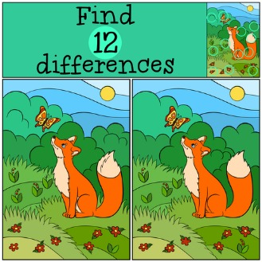
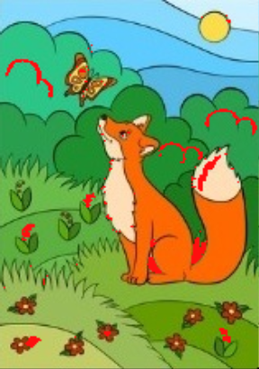
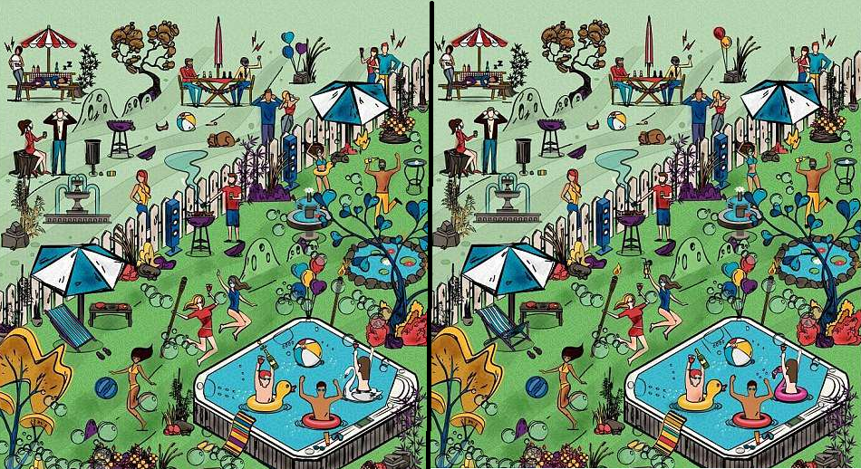
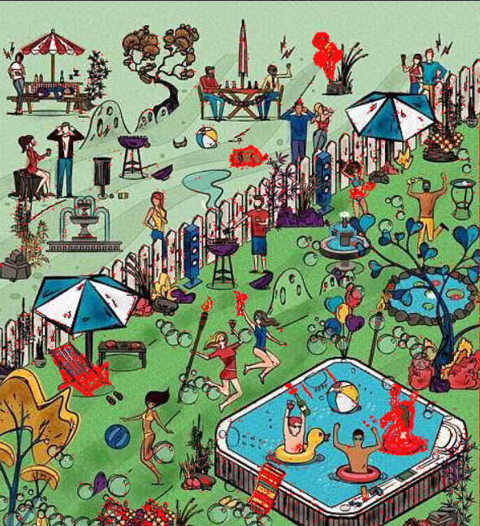

# Imagediff
## To win all the 'find the differences' games!
(Copied from the file header)
A simple scripts which solves all the                    
'find the differences' games! the scripts loads two images and marks in red the different pixels area in the images.  
Syntax: imagediff (path-to-image1) (path-to-image2)       
Example: imagediff ./sample_image.jpg ./sample_image2.jpg   
Author: Ofek Bader  
Version: 1.0  
Last Updated: 30/03/2019  
Python Version: 2.7.10  
Dependencies: Pillow v5.4.1 (a PIL fork)  

## Example:
Given the challenge to find 12 differences:  
 

## Example 2
 

